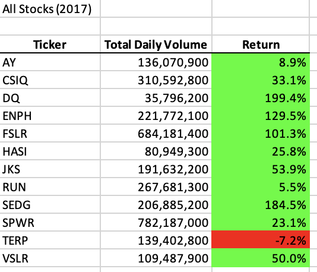

# Analyzing Stocks with VBA

## Overview of Project

### Background
Microsoft Visual Basic Analysis (or VBA) is a powerful tool for adding automation to Excel and other MS programs. In this mini-project, I took a sample dataset and applied concepts like macros, formatting, and runtimes to simplify the process of analyzing data and organizing results, all with VBA.

### Purpose
I was tasked with helping a friend create an analysis tool to gain insight on investment protfolio diversity using VBA. The results will be used to help his parents choose new investments in the alternative energy sector, which they are quite passionate about.

## Analysis and Challenges

### Runtime-Optimal Macros to Analyze Stock Data
In the developer tools section of Excel, I began writing a script inside a module of Visual Basic that would allow me to access daily ticker, trade volume, and return-on-investment (ROI) data in sheets organized by year. Using this information, I would extract an annual trade volume and ROI percentage categorized by each ticker value inside a table in a separate sheet. To monitor script performance, I used the **Timer** command to find the time difference between the approximate start and end of the script. I created the script in two different ways but I only dive into the *refactored* version, as it was more optimal for this dataset. I will discuss this concept more at the end.

```
Dim startTime As Single
Dim endTime  As Single
.
.
.
startTime = Timer
.
.
.
endTime = Timer
MsgBox "This code ran in " & (endTime - startTime) & " seconds for the year " & (yearValue)
```

### Initializing Output Sheet
First, the script would ask the user which year (sheet) to pull data from. After this input, the new sheet would be populated with a title based on the chosen year, as well as headers for **Ticker ID**, **Total Daily Volume**, and **Return**. An array, **tickers**, was then created to store all of the unique ticker names I would use to categorize the data.

```
Worksheets("All Stocks Analysis").Activate
    
Range("A1").Value = "All Stocks (" + yearValue + ")"

'Create a header row
Cells(3, 1).Value = "Ticker"
Cells(3, 2).Value = "Total Daily Volume"
Cells(3, 3).Value = "Return"

'Initialize array of all tickers
Dim tickers(12) As String

tickers(0) = "AY"
tickers(1) = "CSIQ"
tickers(2) = "DQ"
tickers(3) = "ENPH"
tickers(4) = "FSLR"
tickers(5) = "HASI"
tickers(6) = "JKS"
tickers(7) = "RUN"
tickers(8) = "SEDG"
tickers(9) = "SPWR"
tickers(10) = "TERP"
tickers(11) = "VSLR"
``` 

### Pulling Data from Year Sheet
Next, I began extracting the necessary data from the selected year datasheet. This process began by determining adn storing the number of rows to iterate over in the **RowCount** variable. Then, three new arrays, **tickerVolumes**, **tickerStartingPrices**, and **tickerEndingPrices**, were created to store data from each ticker ID and output the data into the new sheet's table later on. A **tickerIndex** variable was used to scroll through these arrays and update the correct values without overwriting. After initializing **tickerVolumes** to start each value at zero, a FOR loop was made to iterate over each of the relavent rows to do the following:

  1. Add the daily Volume to **tickerVolume** for the selected **tickerIndex** value
  
  2. Determine the start day and end day of each ticker (already ordered chronologically) to determine the **tickerStartingPrices** and         **tickerEndingPrices**
  
  3. Add +1 to **tickerIndex** so that the next loop did not overwrite any array data and place data in appropriate position

```
Worksheets(yearValue).Activate
    
'Get the number of rows to loop over
RowCount = Cells(Rows.Count, "A").End(xlUp).Row

'1a) Create a ticker Index

Dim tickerIndex As Single
tickerIndex = 0

'1b) Create three output arrays
Dim tickerVolumes(12) As Long
Dim tickerStartingPrices(12) As Single
Dim tickerEndingPrices(12) As Single


''2a) Create a for loop to initialize the tickerVolumes to zero.

For i = 0 To 11

    tickerVolumes(i) = 0

Next i

''2b) Loop over all the rows in the spreadsheet.
For i = 2 To RowCount


    '3a) Increase volume for current ticker
    tickerVolumes(tickerIndex) = tickerVolumes(tickerIndex) + Cells(i, 8).Value

    '3b) Check if the current row is the first row with the selected tickerIndex.
    If Cells(i - 1, 1).Value <> tickers(tickerIndex) And Cells(i, 1).Value = tickers(tickerIndex) Then

        tickerStartingPrices(tickerIndex) = Cells(i, 6).Value

    End If

    '3c) check if the current row is the last row with the selected ticker
     'If the next row’s ticker doesn’t match, increase the tickerIndex.
    If Cells(i + 1, 1).Value <> tickers(tickerIndex) And Cells(i, 1).Value = tickers(tickerIndex) Then

        tickerEndingPrices(tickerIndex) = Cells(i, 6).Value

        '3d Increase the tickerIndex.
        tickerIndex = tickerIndex + 1

    End If

Next i
```

### Copy Array Data to New Sheet
The arrays were then unloaded into the new sheet, their values placed underneath the original headers created earlier in the script.

```
For i = 0 To 11
        
    Worksheets("All Stocks Analysis").Activate

    Cells(4 + i, 1).Value = tickers(i)

    Cells(4 + i, 2).Value = tickerVolumes(i)

    Cells(4 + i, 3).Value = tickerEndingPrices(i) / tickerStartingPrices(i) - 1

Next i
```

### Format Data in New Sheet
The table was cleaned up for human eyes using the Visual Basic boldening, border, linestyle, numberfit, and centering (autofit) features. ROIs were then formatted to be red if negative, and green if positive using a For loop and vb color values.

```
Worksheets("All Stocks Analysis").Activate
Range("A3:C3").Font.FontStyle = "Bold"
Range("A3:C3").Borders(xlEdgeBottom).LineStyle = xlContinuous
Range("B4:B15").NumberFormat = "#,##0"
Range("C4:C15").NumberFormat = "0.0%"
Columns("B").AutoFit

dataRowStart = 4
dataRowEnd = 15

For i = dataRowStart To dataRowEnd

    If Cells(i, 3) > 0 Then

        Cells(i, 3).Interior.Color = vbGreen

    Else

        Cells(i, 3).Interior.Color = vbRed

    End If

Next i
```

## Results

### ROI by Year

#### 2017 Analysis
The resulting table after selecting 2017 is shown below:



The 2017 Analysis shows that the best ROIs came from **DQ** and **SEDG** for this year, and the worst ROI came from **TERP**.

#### 2018 Analysis
The resulting table after selecting 2018 is shown below:


The 2018 Analysis shows that the best ROIs came from **ENPH** and **RUN** for this year, and the worst ROI came from **DQ**.

### Runtime Before and After Refactoring

#### 2017 Runtimes
The 2017 runtimes for the original and refactored scripts are shown below:

 

The refactored runtime was ___% faster than the original for 2017.

#### 2018 Runtimes
The 2018 runtimes for the original and refactored scripts are shown below:

 

The refactored runtime was ___% faster than the original for 2018.


## Conclusion

### Advantages of Refactoring
Runtime and memory usage can often be reduced significantly when a script is refactored. The speed of this VBA script, for instance, increased by ___% Refactoring can also improve optimzation for larger datasets.

### Disadvantages of Refactoring
Refactoring a script requires a deeper understanding of the program and dataset. This alone can introduce human error / bugs to the script. When I wrote the first script (not shown in this report), I had the idea of using arrays to reduce the amount of switching back and forth between sheets (.Activate function). However, I did not know exactly how to do this in visual basic yet.
